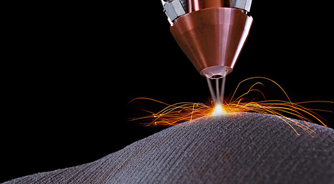
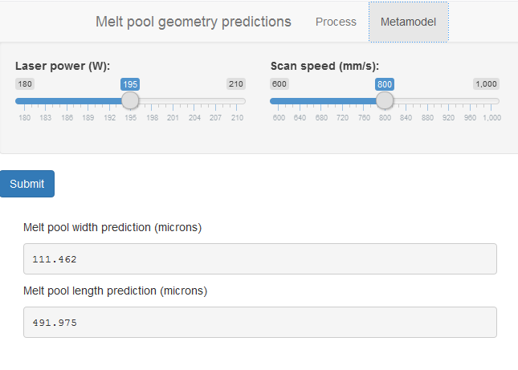

## Selective laser melting

Additive manufacturing process that creates solid metal parts directly
from 3D CAD data. The quality of the obtained part is highly related to
the geometry of the melt pool during the process.



---

## A metamodel approach

Exploration of the design space is slow and expensive. Not only are the materials
expensive, but the large number of process parameters results in a large parameter
space to explore.

As an alternative, we propose a metamodel (model of a model) trained with finite element
predictions to return quick estimates of melt pool geometry.

The data was gathered from an ABAQUS model developed at NIST for melt pool geometry
predictions in SLM of Inconel 625.

---

## Gaussian process regression

The Gaussian Process Regression (GPR) is used to obtain surrogate
models for melt pool width and length, using laser power and scan speed
as regressors.


```r
GPRmodel1 <- gausspr(W ~ P+v, data = myTraining, kernel="rbfdot")
GPRmodel2 <- gausspr(L ~ P+v, data = myTraining, kernel="rbfdot")

width <- function(Ppred, vpred){
  width  <- predict(GPRmodel1, data.frame(P = Ppred, v = vpred))
}

length <- function(Ppred, vpred){
  length  <- predict(GPRmodel2, data.frame(P = Ppred, v = vpred))
}
```

---

## Metamodeling app



For comments and suggestions, email felipelopez@utexas.edu
